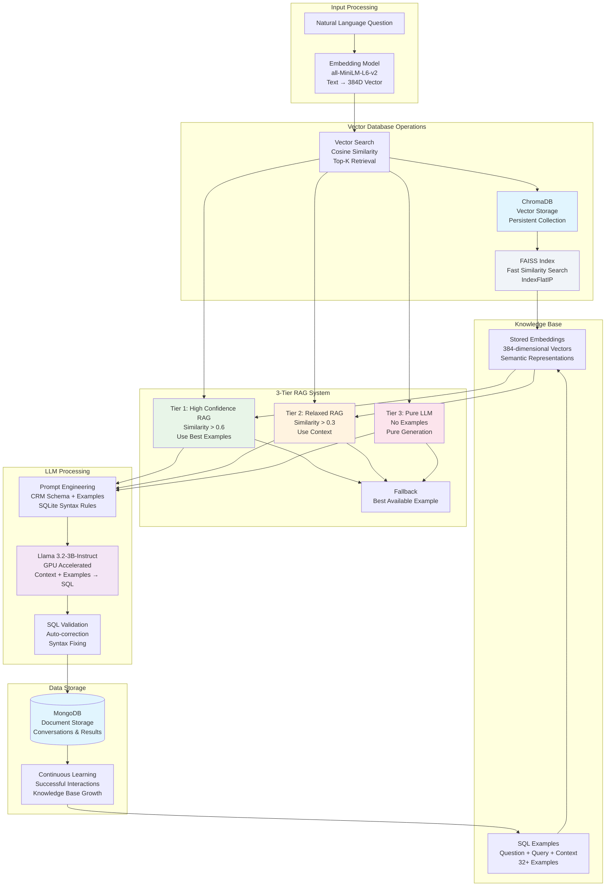

# 🚀 MongoDB Retriever System - Cloud Deployment Report

**Simple Cost Analysis & Architecture Overview**

---

## 📋 System Overview

This is an **AI-powered document retrieval system** with:

- **🎯 3-Tier RAG (Retrieval-Augmented Generation)**
- **🤖 Llama 3.2-3B-Instruct Language Model** 
- **📊 MongoDB Database**
- **⚡ ChromaDB + FAISS Vector Search**

---

## 🏗️ System Architecture



---

## 🔄 How It Works

### **Step 1: Question Processing**
```
User Question → Embedding Model → Vector Representation
```

### **Step 2: 3-Tier RAG System**
```
Tier 1: High Confidence Match (>60% similarity)
    └── Use existing examples + LLM

Tier 2: Medium Confidence (>30% similarity)  
    └── Use context + LLM

Tier 3: Pure LLM Generation
    └── No examples needed
```

### **Step 3: Response Generation**
```
Vector Search → Similar Examples → LLM Processing → Final Answer
```

### **Data Flow:**
1. **User asks question** in natural language
2. **System converts** question to vector embedding
3. **ChromaDB searches** for similar previous questions
4. **FAISS provides** fast similarity matching
5. **Llama model generates** response using retrieved context
6. **MongoDB stores** conversation history and results

---

## 💰 AWS Hosting Costs (Cheapest Options)

### **Monthly Costs Breakdown**

| Component | AWS Service | Instance Type | Monthly Cost |
|-----------|-------------|---------------|--------------|
| **API Server** | EC2 | t3.small | $15 |
| **LLM Processing** | EC2 GPU | g4dn.large | $85 |


---

## 🚀 Simple Deployment

### **What You Need:**
- 1x EC2 instance for API (t3.small)
- 1x EC2 GPU instance for LLM (g4dn.large) 
- 1x DocumentDB cluster (t3.medium)
- S3 bucket for vector storage


---

## 📊 Resource Requirements

| Resource | Minimum | Recommended |
|----------|---------|-------------|
| **RAM** | 8GB | 16GB |
| **GPU** | 16GB VRAM | 24GB VRAM |
| **Storage** | 50GB | 100GB |
| **CPU** | 2 cores | 4 cores |

---


*Simple Report - No Migration Required*  
*Ready to Deploy on AWS* 